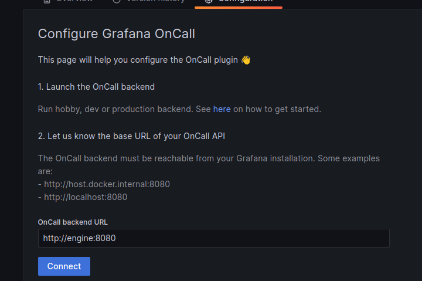
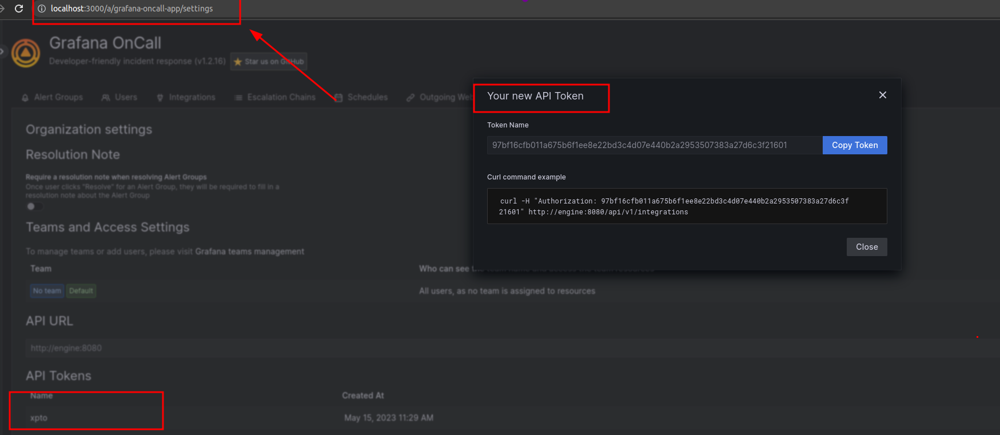
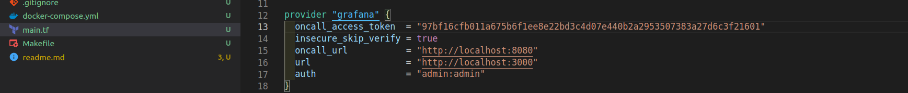
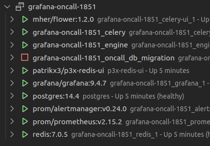
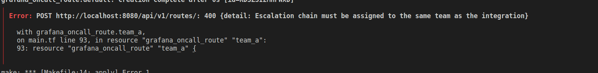

# Project

This project serves to reproduce the integration error.

# Steps to reproduce

1. Clone this repository
2. Run `make setup`
3. Run `make up`
4. Open http://localhost:3000
5. Configure the oncall plugin <br/>

6. Create token  <br/>

7. Add token to the plugin configuration in the `main.tf` file <br/>

8. Run `make apply`


In the end, we will have the following scenario:




# Expected behavior

The integration should work with the route going to another team (different from the team that the integration is on)

# Actual behavior


```
Error: POST http://localhost:8080/api/v1/routes/: 400 {detail: Escalation chain must be assigned to the same team as the integration}
```
